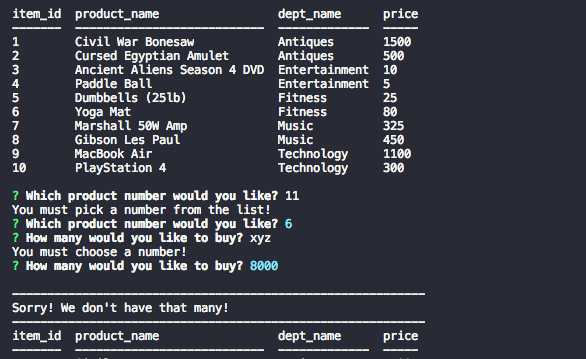

# BamazonHW
## CLI App using MySQL and node.js imitating a small Amazon style marketplace

###### The app begins by showing you a list of products, along with their department and price

###### If you've selected a quantity that's in stock, you'll get something like the following screen, where you're given your bill and quickly asked if you'd like to make any further purchases

###### The app has a few error handling capabilities, so you must choose an actual product number, the quantity you choose must be a non-zero number, and you can't order too much of something if it's not in stock.  If you've violated any of those rules, the app will simply restart at the beginning.

